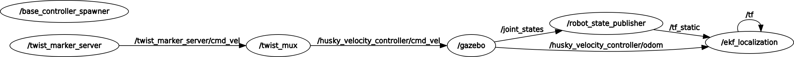
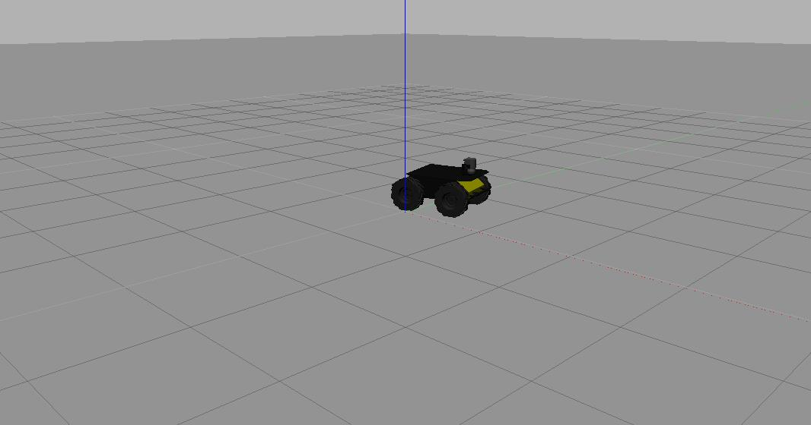
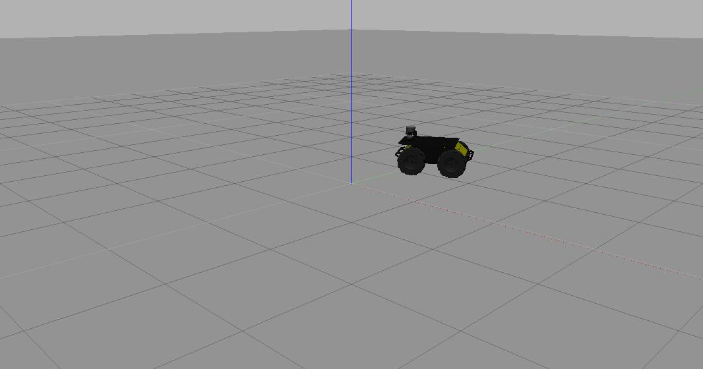
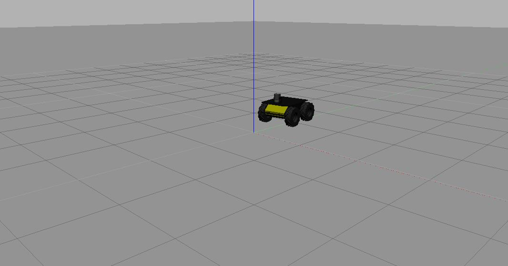
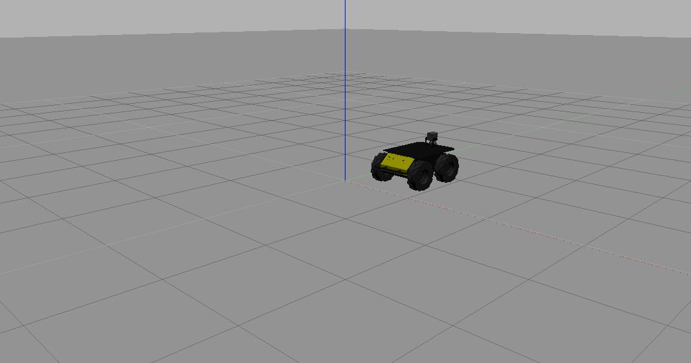
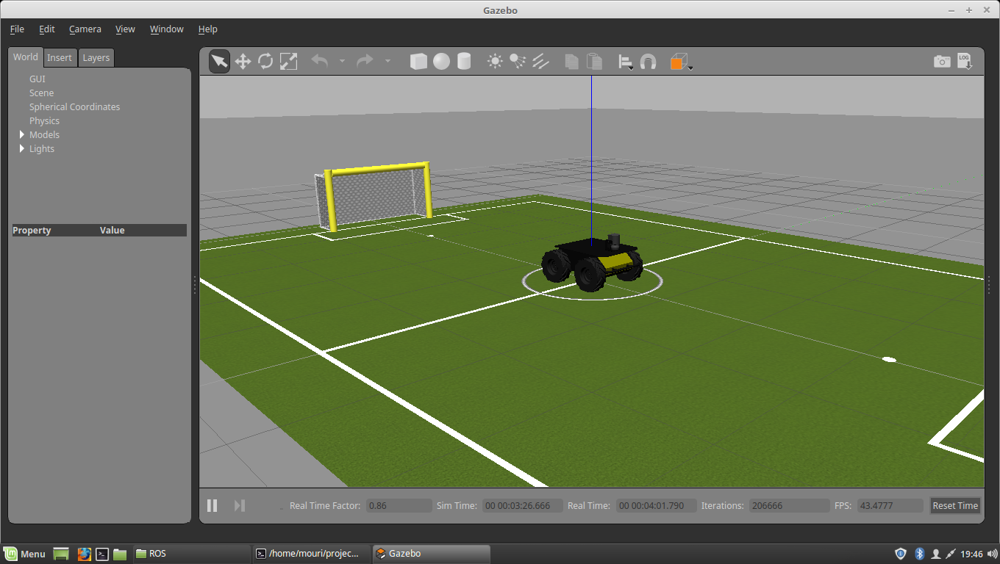
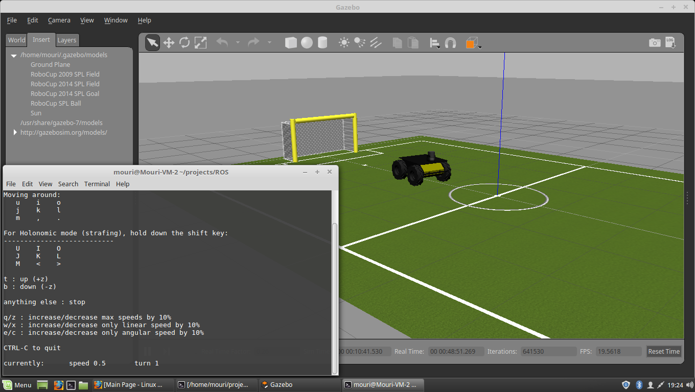

# ROS.log

以下是一些关于机器人操作系统即 ROS 的笔记。

- [环境搭建](#环境搭建)
  - [安装 Linux 发行版](安装-Linux-发行版)
  - [安装 ROS Kinetic Kame](安装-ROS-Kinetic-Kame)
    - [设置 ROS 安装源](设置-ROS-安装源)
    - [安装 ROS 安装源签名](安装-ROS-安装源签名)
    - [更新 apt 安装源数据库](更新-apt-安装源数据库)
    - [完整安装 ROS 桌面版](完整安装-ROS-桌面版)
    - [初始化 ROS 依赖](初始化-ROS-依赖)
    - [把 ROS 写入环境变量](把-ROS-写入环境变量)
    - [安装构建一个 ROS 包需要的依赖](安装构建一个-ROS-包需要的依赖)
  - [对自己工作环境的简单配置](对自己工作环境的简单配置)
- [ROS编程 ETH 2018 更新版习题（一）](ROS编程-ETH-2018-更新版习题（一）)
  - [项目概述](项目概述)
  - [练习](练习)
    - [安装 Husky](安装-Husky)
    - [使用 Husky](使用-Husky)
      - [注册环境变量](注册环境变量)
      - [解决 VMware 虚拟机下 gazebo 报错问题](解决-VMware-虚拟机下-gazebo-报错问题)
      - [运行 Husky](运行-Husky)
    - [实验](实验)
      - [启动其中一个仿真，对 rosnode list、rostopic list、rostopic echo [TOPIC]、rostopic hz [TOPIC]、rqt_graph 命令进行练习和操作。](启动其中一个仿真，对-rosnode-list、rostopic-list、rostopic-echo-[TOPIC]-、rostopic-hz-[TOPIC]、rqt_graph-命令进行练习和操作。)
      - [通过终端发送一个速度指令给机器人 rostopic pub [TOPIC]](通过终端发送一个速度指令给机器人-rostopic-pub-[TOPIC])
      - [编写代码使用键盘或者手柄遥控机器人运动](编写代码使用键盘或者手柄遥控机器人运动)
        - [安装控制工具](安装控制工具)
        - [运行控制工具](运行控制工具)
        - [控制截图](控制截图)
      - [新建 launch 文件使用 robotcup 环境，并且使用键盘控制机器人运动。](新建-launch-文件使用-robotcup-环境，并且使用键盘控制机器人运动。)
        - [在 src/husky_simulator/husky_gazebo/launch 创建 husky_robocup14.launch](在-src/husky_simulator/husky_gazebo/launch-创建-husky_robocup14.launch)
        - [运行截图](运行截图)

## 环境搭建

### 安装 Linux 发行版
我安装的 Linux 发行版是 Linux Mint 18.3 'Sylvia'，
安装镜像可以在 Linux Mint 官方网站 https://www.linuxmint.com/ 下载，
如果你使用的是VMware虚拟机，则推荐安装VMware Tools。

### 安装 ROS Kinetic Kame
参考资料：http://wiki.ros.org/kinetic/Installation/Ubuntu 

#### 设置 ROS 安装源
> sudo sh -c '. /etc/lsb-release && echo "deb http://mirrors.ustc.edu.cn/ros/ubuntu/ xenial main" > /etc/apt/sources.list.d/ros-latest.list'

#### 安装 ROS 安装源签名
> sudo apt-key adv --keyserver hkp://ha.pool.sks-keyservers.net:80 --recv-key 421C365BD9FF1F717815A3895523BAEEB01FA116

#### 更新 apt 安装源数据库
> sudo apt-get update

#### 完整安装 ROS 桌面版
> sudo apt-get install ros-kinetic-desktop-full

#### 初始化 ROS 依赖
> sudo rosdep init

> rosdep update

#### 把 ROS 写入环境变量
> echo "source /opt/ros/melodic/setup.bash" >> ~/.bashrc

> source ~/.bashrc

#### 安装构建一个 ROS 包需要的依赖
> sudo apt-get install python-rosinstall python-rosinstall-generator python-wstool build-essential

### 对自己工作环境的简单配置
> mkdir projects

> cd projects

> mkdir ROS

> cd ROS

## ROS编程 ETH 2018 更新版习题（一）
参考资料：https://blog.csdn.net/zhangrelay/article/details/79463992 

### 项目概述
- ROS 体系结构
- ROS 主节点和主题
- 控制台命令
- Catkin 工作区和编译系统
- 启动（launch）-文件

### 练习

#### 安装 Husky
编译和运行 Husky 模拟器参考的资料：
- https://answers.ros.org/question/256756/how-to-install-husky-simulator-in-kinetic
- http://answers.gazebosim.org/question/12386/tips-on-troubleshooting-segmentation-fault-core-dumped/ 
- http://blog.exbot.net/archives/3035 

使用git客户端克隆 Husky 模拟器的 GitHub 仓库并编译 Husky 模拟器，
在终端输入以下命令。

> mkdir src

> cd src

> git clone https://github.com/husky/husky.git

> git clone https://github.com/husky/husky_simulator.git

> git clone https://github.com/husky/husky_desktop.git

> cd ..

> catkin_make

> sudo apt-get install ros-kinetic-gazebo-ros-pkgs ros-kinetic-gazebo-ros-control ros-kinetic-multimaster-launch ros-kinetic-lms1xx

> rosdep install --os=ubuntu:xenial --from-path src --ignore-src -y

> catkin_make

#### 使用 Husky
Husky 模拟器官方教程
- http://wiki.ros.org/husky_gazebo/Tutorials/Simulating%20Husky

##### 注册环境变量
> source devel/setup.bash

> export HUSKY_GAZEBO_DESCRIPTION=$(rospack find husky_gazebo)/urdf/description.gazebo.xacro

##### 解决 VMware 虚拟机下 gazebo 报错问题
> echo " export SVGA_VGPU10=0" >> ~/.bashrc

> source ~/.bashrc

##### 运行 Husky
> roslaunch husky_gazebo husky_empty_world.launch

#### 实验

##### 启动其中一个仿真，对 rosnode list 、rostopic list 、rostopic echo [TOPIC] 、rostopic hz [TOPIC] 、rqt_graph 命令进行练习和操作。
> rosnode list
```
/base_controller_spawner
/ekf_localization
/gazebo
/robot_state_publisher
/rosout
/twist_marker_server
/twist_mux
```

> rostopic list
```
/clock
/cmd_vel
/diagnostics
/e_stop
/gazebo/link_states
/gazebo/model_states
/gazebo/parameter_descriptions
/gazebo/parameter_updates
/gazebo/set_link_state
/gazebo/set_model_state
/husky_velocity_controller/cmd_vel
/husky_velocity_controller/odom
/imu/data
/imu/data/accel/parameter_descriptions
/imu/data/accel/parameter_updates
/imu/data/bias
/imu/data/rate/parameter_descriptions
/imu/data/rate/parameter_updates
/imu/data/yaw/parameter_descriptions
/imu/data/yaw/parameter_updates
/joint_states
/joy_teleop/cmd_vel
/navsat/fix
/navsat/fix/position/parameter_descriptions
/navsat/fix/position/parameter_updates
/navsat/fix/status/parameter_descriptions
/navsat/fix/status/parameter_updates
/navsat/fix/velocity/parameter_descriptions
/navsat/fix/velocity/parameter_updates
/navsat/vel
/odometry/filtered
/platform_control/cmd_vel
/rosout
/rosout_agg
/scan
/set_pose
/tf
/tf_static
/twist_marker_server/cmd_vel
/twist_marker_server/feedback
/twist_marker_server/update
/twist_marker_server/update_full
```

> rostopic echo /gazebo/model_states
```
name: [ground_plane, mobile_base]
pose: 
  - 
    position: 
      x: 0.0
      y: 0.0
      z: 0.0
    orientation: 
      x: 0.0
      y: 0.0
      z: 0.0
      w: 1.0
  - 
    position: 
      x: 0.000512390811999
      y: -0.00138900361382
      z: 0.132278713653
    orientation: 
      x: 1.24997257154e-07
      y: 1.32847453505e-09
      z: 0.000104073000871
      w: 0.999999994584
twist: 
  - 
    linear: 
      x: 0.0
      y: 0.0
      z: 0.0
    angular: 
      x: 0.0
      y: 0.0
      z: 0.0
  - 
    linear: 
      x: 6.74376201995e-07
      y: -3.92123753947e-07
      z: 7.58464770525e-06
    angular: 
      x: 2.6971135081e-06
      y: 2.60728470282e-07
      z: 3.02012083569e-09
---
```

> rostopic hz /gazebo/set_model_state
```
subscribed to [/gazebo/model_states]
average rate: 1000.000
	min: 0.000s max: 0.007s std dev: 0.00045s window: 941
average rate: 1000.000
	min: 0.000s max: 0.007s std dev: 0.00038s window: 1925
average rate: 1000.000
	min: 0.000s max: 0.008s std dev: 0.00041s window: 2896
average rate: 1000.258
	min: 0.000s max: 0.008s std dev: 0.00038s window: 3878
average rate: 1000.000
	min: 0.000s max: 0.008s std dev: 0.00036s window: 4862
average rate: 1000.000
	min: 0.000s max: 0.008s std dev: 0.00036s window: 5849
average rate: 1000.147
	min: 0.000s max: 0.052s std dev: 0.00130s window: 6822
average rate: 1000.128
	min: 0.000s max: 0.052s std dev: 0.00124s window: 7786
average rate: 1000.000
	min: 0.000s max: 0.052s std dev: 0.00118s window: 8730
average rate: 1000.103
	min: 0.000s max: 0.052s std dev: 0.00112s window: 9721
average rate: 1000.094
	min: 0.000s max: 0.052s std dev: 0.00107s window: 10690
average rate: 1000.000
	min: 0.000s max: 0.052s std dev: 0.00104s window: 11674
average rate: 1000.079
	min: 0.000s max: 0.052s std dev: 0.00101s window: 12634
average rate: 1000.000
	min: 0.000s max: 0.052s std dev: 0.00098s window: 13624
average rate: 1000.000
	min: 0.000s max: 0.052s std dev: 0.00094s window: 14621
average rate: 1000.000
	min: 0.000s max: 0.052s std dev: 0.00092s window: 15620
average rate: 1000.000
	min: 0.000s max: 0.052s std dev: 0.00090s window: 16591
average rate: 1000.000
	min: 0.000s max: 0.052s std dev: 0.00089s window: 17555
average rate: 1000.054
	min: 0.000s max: 0.052s std dev: 0.00087s window: 18537
average rate: 1000.000
	min: 0.000s max: 0.052s std dev: 0.00085s window: 19501
average rate: 1000.049
	min: 0.000s max: 0.052s std dev: 0.00084s window: 20381
```

> rqt_graph



##### 通过终端发送一个速度指令给机器人 rostopic pub [TOPIC]
> rostopic pub -r 10 /cmd_vel geometry_msgs/Twist '[2.0, 0.0, 0.0]' '[0.0, 0.0, 1.8]'
```
Moving circle...
```

##### 编写代码使用键盘或者手柄遥控机器人运动

###### 安装控制工具
> sudo apt-get install ros-kinetic-teleop-twist-keyboard

###### 运行控制工具
> rosrun teleop_twist_keyboard teleop_twist_keyboard.py
```
Reading from the keyboard  and Publishing to Twist!
---------------------------
Moving around:
   u    i    o
   j    k    l
   m    ,    .

For Holonomic mode (strafing), hold down the shift key:
---------------------------
   U    I    O
   J    K    L
   M    <    >

t : up (+z)
b : down (-z)

anything else : stop

q/z : increase/decrease max speeds by 10%
w/x : increase/decrease only linear speed by 10%
e/c : increase/decrease only angular speed by 10%

CTRL-C to quit

currently:	speed 0.5	turn 1 
```

###### 控制截图







	
##### 新建 launch 文件使用 robotcup 环境，并且使用键盘控制机器人运动。


###### 在 src/husky_simulator/husky_gazebo/launch 创建 husky_robocup14.launch
```
<?xml version="1.0"?>   
<launch>  
  
  <arg name="world_name" default="/usr/share/gazebo-7/worlds/robocup14_spl_field.world"/>  
  
  <arg name="laser_enabled" default="true"/>  
  <arg name="kinect_enabled" default="false"/>  
  
  <include file="$(find gazebo_ros)/launch/empty_world.launch">  
    <arg name="world_name" value="$(arg world_name)"/> <!-- world_name is wrt GAZEBO_RESOURCE_PATH environment variable -->  
    <arg name="paused" value="false"/>  
    <arg name="use_sim_time" value="true"/>  
    <arg name="gui" value="true"/>  
    <arg name="headless" value="false"/>  
    <arg name="debug" value="false"/>  
  </include>  
  
  <include file="$(find husky_gazebo)/launch/spawn_husky.launch">  
    <arg name="laser_enabled" value="$(arg laser_enabled)"/>  
    <arg name="kinect_enabled" value="$(arg kinect_enabled)"/>  
  </include>  
  
  <node pkg="teleop_twist_keyboard" name="teleop_husky" type="teleop_twist_keyboard.py"/>  
  
</launch>
```

###### 运行截图



